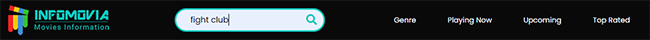
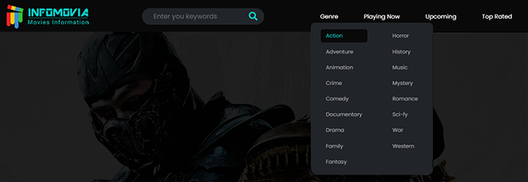
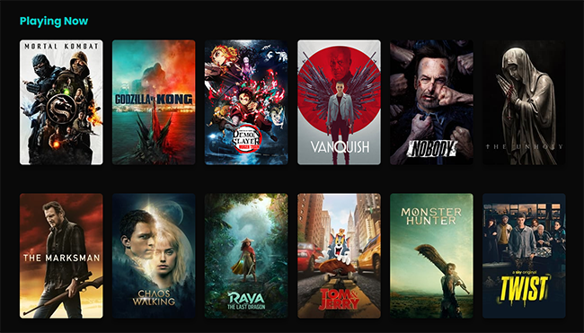
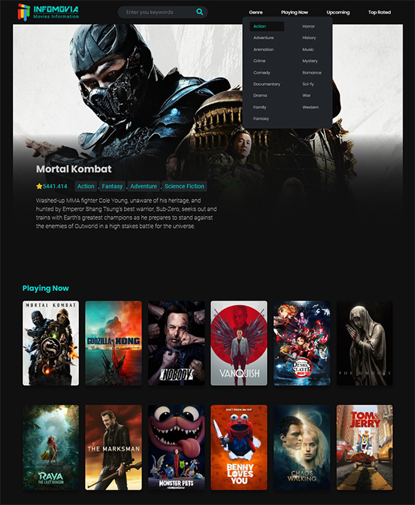
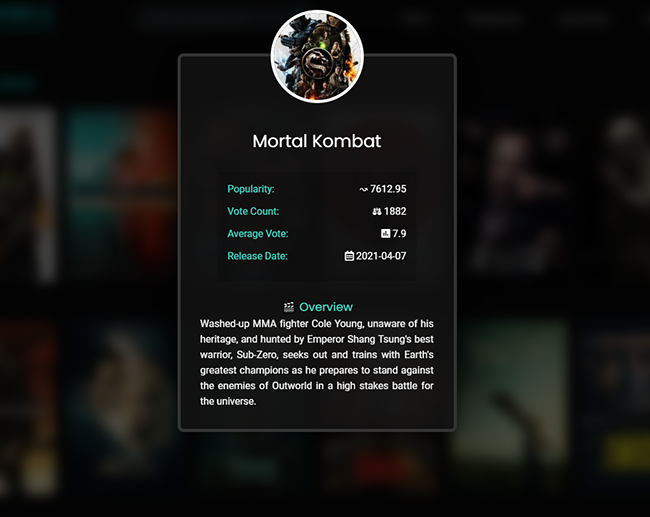
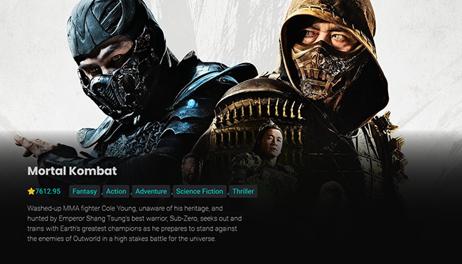

[ ![Status][Badge-Status] ][Site-Page]

 
# **InfoMovia** App
## Description
We all love to know latest information about our favorite Movies and TV shows. MovieMania enables you to find information about your favorite, currently playing, upcoming and popular movies/TV shows. 

This is a fully **📱 responsive, 💻 front-end, ⚙ vanilla js, and api** based project. 

## Demo

### 🔗 [Demo Link](adnanniaz77.github.io/movie-mania/)

# Build with:
 1. [](https://www.w3schools.com/html/)
 2. [](https://www.w3schools.com/css/)
 3. [](https://www.w3schools.com/js/)

# Tools Used
 - [](https://https://code.visualstudio.com/)
 - [](https://https://code.github.com/)
 - [](https://https://code.github.com/)
 - [](https://https://code.github.com/)
 4. [](https://developer.mozilla.org/en-US/docs/Web/JavaScript/Reference/Global_Objects/Error)
 5. [](https://www.tutorialspoint.com/javascript/javascript_error_handling.htm)
 6. [](https://developers.themoviedb.org/3)
 7. [](https://developer.mozilla.org/en-US/docs/Learn/JavaScript/Asynchronous/Async_await)

# Concepts Covered
 - DOM setup and reference
 - Re-usable functions i.e. (API calls)
 - Page layout with Flex-box (CSS)
 - CSS variable
 - Responsiveness (Mobile friendly)
 - 

# App Features
## 🔎 Search by keywords:
   1. Users can find movies or TV-shows information by typing keywords
   2. Keyword can be submitted by either Pressing Enter or Clicking on Magnifying glass icon 


- - -
## 🔎 Search by Genre
   1. Users can find movies or TV-shows information by genre
   2. Genre Link are available in the Header main navigation's drop-down menu


- - -

## 🔎 Search by Categories
   1. User can also find their favorite movies and tv-shows information by category list
   2. Category list are provided on the main landing page or can be navigated-to using 
      the header' main Navigation links



- - -

# Final Image


 # Modal


 # Carousel


# Project Break Down
 1. Design / Figma Wire-frame
 2. HTML Layout / structure / markup
 3. CSS flex-box and grid
 4. Micro-interactions
 5. Error-handling
 6. Exception
 7. Modals

```
Folder Structure
assets
|   |-- images
|   |   |-- imdb.png
|   |   |-- img1.png
|   |   |-- img5.png
|   |   |-- img6.png
|   |   |-- infomovia.png
|   |   |-- poster1.png
|   |   |-- poster2.png
|   |   +-- typography.md
|   |
|   |-- js
|   |   |-- app.js
|   |   |-- carousel.js
|   |   |-- genre.js
|   |   +-- search.md
|   |
|   |-- css
|   |   |-- reset.css
|   |   +-- style.css
index.html
README.md
temp.html
```

[Badge-Status]: https://img.shields.io/badge/Status-In_Development-informational?style=for-the-badge
[Badge-Contributors]: https://img.shields.io/badge/Contributors-4-lightgreen?style=for-the-badge
[Site-Page]: https://

[Figma]: https://www.figma.com/file/teMV2bbWUKLSKlkn8NHn0I/Poke-Store?node-id=0%3A1
[Trello]: https://trello.com/b/fz2gTMMX/poke-store
[Google Docs]: ___

[React]: https://reactjs.org/
[Sass]: https://sass-lang.com/
[JavaScript]: https://en.wikipedia.org/wiki/JavaScript
[TypeScript]: https://www.typescriptlang.org/
[React-Router-Dom]: https://reactrouter.com/
[Badge-React]: https://img.shields.io/badge/-React-20232A.svg?&style=for-the-badge&logo=React&logoColor=61DAFB
[Badge-Sass]: https://img.shields.io/badge/-Sass-hotpink.svg?&style=for-the-badge&logo=Sass&logoColor=FFF
[Badge-JavaScript]: https://img.shields.io/badge/-JavaScript-323330.svg?&style=for-the-badge&logo=JavaScript&logoColor=F0DB4F
[Badge-TypeScript]: https://img.shields.io/badge/-TypeScript-323330.svg?&style=for-the-badge&logo=TypeScript&logoColor=007ACC
[Badge-React-Router-Dom]: https://img.shields.io/badge/-React_Router-CA4245.svg?style=for-the-badge&logo=React-Router&logoColor=FFF
