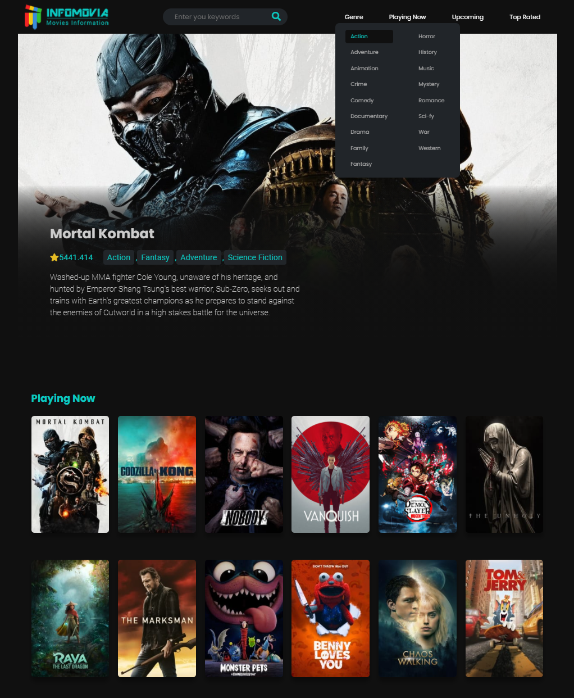

[ ![Status][Badge-Status] ][Site-Page]

# Movie Mania App
We all love movies and TV-shows. Movie Mania is a place where you can find information about your favorite movies, currently playing, upcoming and popular movies/TV shows.

## The App Description
This is a pure custom vanilla js front-end api based app. 

## Demo

### 🔗 [Demo Link](adnanniaz77.github.io/movie-mania/)

# Tech / Tools used
 - HTML
 - CSS
 - Grid Layout and Flex-box
 - JavaScript
 - Fetch
 - Async Approach for calls
 - API (TMDB)
 - Error Handling
 - Exception Handling

# App Features
## 🔎 Search by keywords:
   1. Users can find movies or TV-shows information by typing keywords
   2. Keyword can be submitted by either Pressing Enter or Clicking on Magnifying glass icon

- - -
## 🔎 Search by Genre
   1. Users can find movies or TV-shows information by genre
   2. Genre Link are available in the Header main navigation's drop-down menu

- - -

## 🔎 Search by Categories
   1. User can also find their favorite movies and tv-shows information by category list
   2. Category list are provided on the main landing page or can be navigated-to using 
      the header' main Navigation links

- - -

# Final Image

 # Modal

 # Carousel

# Project Break Down
 1. Design / Figma Wire-frame
 2. HTML Layout / structure / markup
 3. CSS flex-box and grid
 4. Micro-interactions
 5. Error-handling
 6. Exception
 7. Modals

[Badge-Status]: https://img.shields.io/badge/Status-In_Development-informational?style=for-the-badge
[Badge-Contributors]: https://img.shields.io/badge/Contributors-4-lightgreen?style=for-the-badge
[Site-Page]: https://

[Figma]: https://www.figma.com/file/teMV2bbWUKLSKlkn8NHn0I/Poke-Store?node-id=0%3A1
[Trello]: https://trello.com/b/fz2gTMMX/poke-store
[Google Docs]: ___

[React]: https://reactjs.org/
[Sass]: https://sass-lang.com/
[JavaScript]: https://en.wikipedia.org/wiki/JavaScript
[TypeScript]: https://www.typescriptlang.org/
[React-Router-Dom]: https://reactrouter.com/
[Badge-React]: https://img.shields.io/badge/-React-20232A.svg?&style=for-the-badge&logo=React&logoColor=61DAFB
[Badge-Sass]: https://img.shields.io/badge/-Sass-hotpink.svg?&style=for-the-badge&logo=Sass&logoColor=FFF
[Badge-JavaScript]: https://img.shields.io/badge/-JavaScript-323330.svg?&style=for-the-badge&logo=JavaScript&logoColor=F0DB4F
[Badge-TypeScript]: https://img.shields.io/badge/-TypeScript-323330.svg?&style=for-the-badge&logo=TypeScript&logoColor=007ACC
[Badge-React-Router-Dom]: https://img.shields.io/badge/-React_Router-CA4245.svg?style=for-the-badge&logo=React-Router&logoColor=FFF
